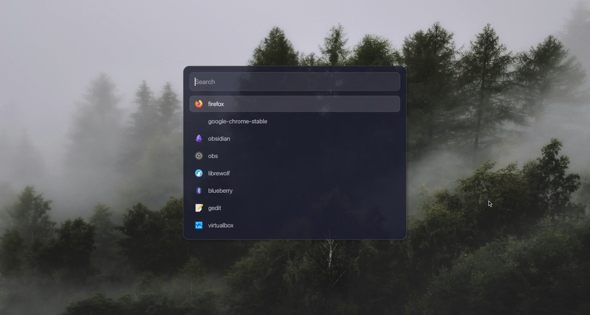

#  Nexus Glass — Apple Glass-Inspired Rofi Theme

A minimal, glassmorphism Rofi theme for Linux desktops, inspired by macOS Big Sur/Monterey and iOS. Features Apple’s SF Pro typography, frosted panels, and subtle highlights.

## ✨ Features

- Authentic glassmorphism (blurred, frosted surfaces)
- SF Pro Display font for native Apple look
- Rounded corners, clean spacing, minimal UI
- Icon support & crisp accent color
- Ready for dark wallpapers and compositing

## 📸 Preview

## 🚀 Installation

1. **Get SF Pro fonts**
   - Easiest (Arch):  
     `yay -S ttf-sf-pro`
   - Or [download OTFs](https://developer.apple.com/fonts/) and place them in `~/.local/share/fonts/`, then run `fc-cache -fv`.

2. **Clone the repo**
     git clone https://github.com/youruser/apple-glass-rofi-theme.git
     cd apple-glass-rofi-theme
    
3. **Copy the theme**
   mkdir -p ~/.config/rofi/themes/
   cp themes/nexus-glass.rasi ~/.config/rofi/themes/

4. **Launch with the theme**
   rofi -show drun -theme nexus-glass

5. *(Optional)* Set as default in your `~/.config/rofi/config.rasi`:
   @theme "nexus-glass"

